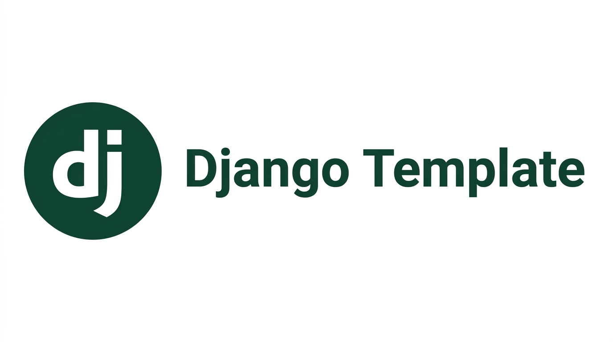

<p align="center">
  
</p>

<p align="center">
  
  
  
  
  
</p>

# Django Custom Template

A production-ready, conventional starter template for building REST APIs with Django and Django REST Framework. It comes with a strict layered architecture, three isolated test tiers, a CI/CD pipeline, and a full set of community health files. everything you need to clone and start building instead of re-scaffolding the same project skeleton from scratch.

## Features

- **Layered architecture** : `views → services → repositories → models`, with the repository layer as the only point of ORM access.
- **Django REST Framework** : session-authenticated CRUD API with pagination and object-level ownership checks.
- **Environment-based settings** : split `base` / `development` / `production` / `test` settings using `django-environ`.
- **Three isolated test tiers** : `unit`, `integration`, and `e2e`, run with pytest and pytest-django against an in-memory SQLite database.
- **CI/CD pipeline** : lint → test (with coverage artifact upload) → Docker build, on every push and pull request.
- **Dockerized** : `Dockerfile` and `docker-compose.yml` with a PostgreSQL service for local development.
- **Full documentation suite** : README, CONTRIBUTING, CODE_OF_CONDUCT, SECURITY, issue forms, and a PR template.
- **Dependabot** : grouped weekly updates for pip, GitHub Actions, and Docker.

## Tech Stack

| Concern            | Choice                                   |
|---------------------|-------------------------------------------|
| Framework           | Django 5.1 + Django REST Framework 3.15  |
| Database            | PostgreSQL (SQLite in-memory for tests)  |
| Auth                | Django session authentication            |
| Testing             | pytest, pytest-django, pytest-cov        |
| Linting/formatting  | ruff, black                              |
| Type checking       | mypy + django-stubs                      |
| Package management  | pip + `requirements.txt`                 |
| Containerization    | Docker + docker-compose                  |

## Project Structure

```
Django-Custom-Template/
├── config/                  # Project configuration
│   ├── settings/
│   │   ├── base.py          # Shared settings
│   │   ├── development.py
│   │   ├── production.py
│   │   └── test.py
│   ├── urls.py
│   ├── wsgi.py
│   └── asgi.py
├── core/                    # Domain app (layered internally)
│   ├── models/
│   ├── serializers/
│   ├── repositories/        # Only layer allowed to touch the ORM
│   ├── services/             # Business logic
│   ├── views/                 # DRF viewsets
│   ├── migrations/
│   ├── admin.py
│   ├── permissions.py
│   ├── exceptions.py
│   └── urls.py
├── tests/
│   ├── unit/                 # Service layer, repository mocked
│   ├── integration/          # Repository layer, real ORM + in-memory DB
│   └── e2e/                   # Full HTTP request/response cycle
├── public/                   # Static assets (banner image, etc.)
├── .github/
│   ├── workflows/ci.yml
│   ├── ISSUE_TEMPLATE/
│   ├── dependabot.yml
│   └── PULL_REQUEST_TEMPLATE.md
├── manage.py
├── requirements.txt
├── requirements-dev.txt
├── pytest.ini
├── pyproject.toml
├── Dockerfile
└── docker-compose.yml
```

## Getting Started

### Prerequisites

- Python 3.12+
- PostgreSQL 16 (or Docker, to run it for you)

### Local Setup

```bash
git clone https://github.com/AzyzHm/Django-Custom-Template.git
cd Django-Custom-Template

python -m venv .venv
source .venv/bin/activate    # Windows: .venv\Scripts\activate

pip install -r requirements-dev.txt

cp .env.example .env         # then fill in your own values

python manage.py migrate
python manage.py createsuperuser
python manage.py runserver
```

### Running with Docker

```bash
cp .env.example .env
docker compose up --build
```

This starts a PostgreSQL instance and the Django app on `http://localhost:8000`.

## API Overview

| Method | Endpoint            | Description                     |
|--------|----------------------|----------------------------------|
| GET    | `/api/items/`        | List the authenticated user's items |
| POST   | `/api/items/`        | Create a new item                |
| GET    | `/api/items/{id}/`   | Retrieve a single item           |
| PUT    | `/api/items/{id}/`   | Update an item                   |
| DELETE | `/api/items/{id}/`   | Delete an item                   |

Authenticate via the browsable API at `/api-auth/login/`, or through the Django admin at `/admin/`.

## Testing

Tests are split into three isolated tiers under `tests/`:

- **`unit/`** : tests the service layer in isolation, with the repository mocked. No database access.
- **`integration/`** : tests the repository layer against a real (in-memory SQLite) database via the ORM.
- **`e2e/`** : exercises full HTTP requests through the DRF API, exactly as a client would.

Run the full suite with coverage:

```bash
pytest
```

Run a single tier:

```bash
pytest tests/unit
pytest tests/integration
pytest tests/e2e
```

## Code Quality

```bash
ruff check .          # lint
black --check .       # formatting check
mypy .                # type checking
```

Optionally install the pre-commit hooks so these run automatically before each commit:

```bash
pre-commit install
```

## Contributing

Contributions are welcome. Please read [CONTRIBUTING.md](CONTRIBUTING.md) before opening a pull request, and note that this project follows a [Code of Conduct](CODE_OF_CONDUCT.md).

## Security

If you discover a security vulnerability, please follow the process described in [SECURITY.md](SECURITY.md) rather than opening a public issue.

## License

This project is licensed under the [MIT License](LICENSE).
